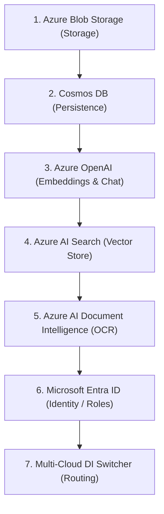

# Phase 5 Implementation Plan: Azure Implementation & Swapped Modules

## Goal Description

Introduce Azure implementations for all core provider-neutral interfaces (`IStorageProvider`, `IEmbeddingProvider`, `IChatProvider`, `IVectorStore`, `IDocumentProcessor`, and repository layers). By the end of this phase, the application will be capable of running entirely on AWS, entirely on Azure, or in a hybrid cloud mode simply by toggling the `"CloudProvider"` environment switch and supplying the relevant configuration settings.

---

## User Review Required

> [!IMPORTANT]
> **Authentication Credentials and Managed Identities**
> Local development will support connection strings or access keys (e.g., Azure Storage connection strings or Cosmos DB keys). Production deployment will prioritize passwordless authentication via `DefaultAzureCredential` (Managed Identities). The options bindings must support both modes transparently.

> [!WARNING]
> **Cosmos DB Partitioning & Indexing**
> Cosmos DB requires partition keys for optimal performance. We must map repository interfaces carefully to ensure partition key strategies (such as partitioning by `OwnerUserId`) align with the data access patterns established in the DynamoDB repositories.

---

## Azure Services & Target Interfaces

The following table lists the Azure services to be implemented and the existing provider-neutral interfaces they will implement:

| Azure Service | Target Interface | Project / File Location | Key Responsibilities |
| :--- | :--- | :--- | :--- |
| **Azure Blob Storage** | `IStorageProvider` | `AwsRagChat.Application/Interfaces/IStorageProvider.cs` | Handle file uploads, stream reading, and generating read-access SAS URLs. |
| **Azure OpenAI Embeddings** | `IEmbeddingProvider` | `AwsRagChat.Application/Interfaces/IEmbeddingProvider.cs` | Generate vector embeddings for ingestion chunks and queries. |
| **Azure OpenAI Chat** | `IChatProvider` | `AwsRagChat.Application/Interfaces/IChatProvider.cs` | Provide retrieval-grounded conversational text generation. |
| **Azure AI Search** | `IVectorStore` | `AwsRagChat.Application/Interfaces/IVectorStore.cs` | Index document chunks and perform vector k-NN queries. |
| **Azure AI Document Intelligence** | `IDocumentProcessor` | `AwsRagChat.Application/Interfaces/IDocumentProcessor.cs` | Parse uploaded PDF/word/text documents and perform OCR extraction. |
| **Cosmos DB** | `IChunkRepository`<br>`IDocumentRepository`<br>`IUserRepository`<br>`IConversationRepository`<br>`IDocumentStatusService` | `AwsRagChat.Application/Interfaces/` | Persist documents, user profiles, conversation histories, and ingestion status. |
| **Microsoft Entra ID** | `IUserRoleService` | `AwsRagChat.Application/Interfaces/IUserRoleService.cs` | Resolve user group memberships and manage enterprise roles. |

---

## Recommended Implementation Order

We recommend implementing the storage and database persistence layers first to establish document ingestion capability, followed by semantic intelligence (Embeddings & Search), and finally document processing and user mapping:



---

## Commit Boundaries

### Commit 1: Azure Storage Provider Integration
*   **Files**:
    *   `[NEW]` `AwsRagChat.Infrastructure/Storage/AzureBlobStorageService.cs`
    *   `[NEW]` `AwsRagChat.Infrastructure/Options/AzureStorageOptions.cs`
*   **Changes**: Implement `IStorageProvider` using the `Azure.Storage.Blobs` SDK. Add option parsing and wire registration into `CloudProviderServiceCollectionExtensions.cs`.

### Commit 2: Cosmos DB Persistence Layer
*   **Files**:
    *   `[NEW]` `CosmosDbChunkRepository.cs`
    *   `[NEW]` `CosmosDbDocumentRepository.cs`
    *   `[NEW]` `CosmosDbConversationRepository.cs`
    *   `[NEW]` `CosmosDbUserRepository.cs`
    *   `[NEW]` `CosmosDbDocumentStatusService.cs`
    *   `[NEW]` `AwsRagChat.Infrastructure/Options/CosmosDbOptions.cs`
*   **Changes**: Implement all repository interfaces using `Microsoft.Azure.Cosmos`. Group partitions by `OwnerUserId` where appropriate.

### Commit 3: Azure OpenAI AI Services (Embeddings & Chat)
*   **Files**:
    *   `[NEW]` `AwsRagChat.Infrastructure/AI/AzureOpenAiEmbeddingService.cs`
    *   `[NEW]` `AwsRagChat.Infrastructure/AI/AzureOpenAiChatCompletionService.cs`
    *   `[NEW]` `AwsRagChat.Infrastructure/Options/AzureOpenAiOptions.cs`
*   **Changes**: Implement `IEmbeddingProvider` and `IChatProvider` utilizing the `Azure.AI.OpenAI` client.

### Commit 4: Azure AI Search Vector Indexer
*   **Files**:
    *   `[NEW]` `AwsRagChat.Infrastructure/Services/AzureAiSearchService.cs`
    *   `[NEW]` `AwsRagChat.Infrastructure/Options/AzureAiSearchOptions.cs`
*   **Changes**: Implement `IVectorStore` (indexing and kNN vector query search) using the `Azure.Search.Documents` SDK.

### Commit 5: Azure AI Document Intelligence Processor
*   **Files**:
    *   `[NEW]` `AwsRagChat.Ingestion/Azure/AzureDocumentProcessor.cs`
    *   `[NEW]` `AwsRagChat.Ingestion/Options/AzureDocumentProcessingOptions.cs`
    *   `[MODIFY]` `AwsRagChat.Ingestion/Aws/AwsIngestionComposition.cs` (to abstract composition loading)
*   **Changes**: Implement `IDocumentProcessor` using the `Azure.AI.DocumentIntelligence` SDK to support synchronous and asynchronous OCR extraction.

### Commit 6: Microsoft Entra ID Authentication & Role Service
*   **Files**:
    *   `[NEW]` `AwsRagChat.Infrastructure/Services/EntraUserRoleService.cs`
*   **Changes**: Implement `IUserRoleService` to resolve directory groups mapping to enterprise roles (`Admin`, `User`, etc.).

### Commit 7: Unified Cloud Switcher & Integration Verification
*   **Files**:
    *   `[MODIFY]` `AwsRagChat.Infrastructure/DependencyInjection/CloudProviderServiceCollectionExtensions.cs`
    *   `[MODIFY]` `AwsRagChat.Api/appsettings.json` (example Azure configurations)
*   **Changes**: Configure `AddCloudProviderInfrastructure` to load and bind either AWS or Azure concrete implementation types dynamically depending on the `"CloudProvider"` setting.

---

## Risk Analysis

*   **SDK Package Version Conflicts**:
    *   *Risk*: Incorporating multiple Azure SDKs can introduce transitively mismatched dependency versions (e.g., `System.Text.Json` or `Azure.Core` conflicts).
    *   *Mitigation*: Enforce deterministic package versions in `Directory.Build.props` or align version declarations in all `.csproj` files.
*   **Cosmos DB Resource Provisioning**:
    *   *Risk*: Cosmos DB queries on non-partitioned fields will result in expensive cross-partition scans.
    *   *Mitigation*: Design the partition key structure (e.g., `/ownerUserId`) to align precisely with query filters.
*   **Index Schema Divergence in Search**:
    *   *Risk*: OpenSearch and Azure AI Search have different index structures and tokenization settings, which could cause inconsistent search results.
    *   *Mitigation*: Align the vector dimension configurations (e.g., 1536 or 1024 depending on the model) and map the query output models to identical `DocumentChunk` structures.

---

## Build Verification Strategy

### 1. Incremental Project Builds
Verify project compilation after each commit boundary:
```powershell
dotnet build AwsRagChat/AwsRagChat.Domain/AwsRagChat.Domain.csproj
dotnet build AwsRagChat/AwsRagChat.Application/AwsRagChat.Application.csproj
dotnet build AwsRagChat/AwsRagChat.Infrastructure/AwsRagChat.Infrastructure.csproj
dotnet build AwsRagChat/AwsRagChat.Ingestion/AwsRagChat.Ingestion.csproj
dotnet build AwsRagChat/AwsRagChat.Api/AwsRagChat.Api.csproj
```

### 2. Full Solution Verification
Execute the full solution check:
```powershell
dotnet build AwsRagChat/AwsRagChat.slnx
```

---

## First Azure Provider To Be Implemented

The **Azure Blob Storage** provider (`AzureBlobStorageService` implementing `IStorageProvider`) must be implemented first. 

*Reasoning*: Document upload and retrieval represent the entry point of the entire ingestion pipeline and RAG loop. Having the storage layer ready allows document ingestion event routing to be built, followed immediately by chunk extraction, chunk database persistence, and vector indexing.
