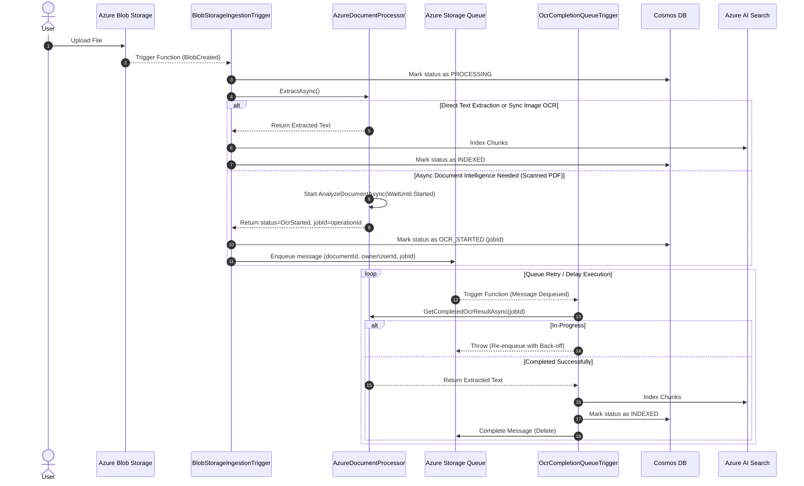

# Phase 6 Commit 2 Plan: Azure Ingestion Trigger Architecture

This plan details the trigger architecture and file modifications required to execute the Azure document ingestion pipeline asynchronously when files are uploaded to Azure Blob Storage.

---

## 1. Cleanest Azure Trigger Architecture

To achieve exact functional parity with the AWS Lambda design (where S3 upload triggers the ingestion flow, and async Textract jobs trigger completion handling via SQS), we will implement an **Azure Functions Isolated Worker Model** structure within the `AwsRagChat.Ingestion` project:

```
[File Upload to Blob] 
    --> BlobStorageIngestionTrigger (Azure Blob Trigger)
            --> Direct text extraction or sync OCR
                    --> Index Chunks directly
            --> Or async OCR starts (returns operationId)
                    --> Send message to Azure Queue (ocr-completion-queue)
                            --> OcrCompletionQueueTrigger (Queue Trigger)
                                    --> Poll status of operationId
                                    --> Finish Ingestion once complete
```

### Preferred Trigger Types
1.  **BlobStorageIngestionTrigger (Azure Blob Storage Trigger):**
    *   *Trigger mechanism:* Listens to the target container path `uploads/{userId}/{documentId}/{fileName}`.
    *   *Role:* Initiates the ingestion process, updates status to `PROCESSING`, and runs `IDocumentProcessor.ExtractAsync`.
2.  **OcrCompletionQueueTrigger (Azure Queue Trigger):**
    *   *Trigger mechanism:* Listens to `ocr-completion-queue`.
    *   *Role:* Evaluates the asynchronous Azure AI Document Intelligence operation status. If in-progress, it throws to retry (allowing Queue retry policies with back-off to re-poll) or enqueues a delayed visibility message. Once complete, it finalizes chunking, embedding, and indexing.

---

## 2. Dependency Coexistence Strategy

Since `AwsRagChat.Ingestion` already contains AWS Lambda triggers and references, we will configure the project to support **dual hosting**:
*   Add Azure Functions SDK package references to `AwsRagChat.Ingestion.csproj`.
*   Maintain the existing `Handlers/` namespace for Lambda functions.
*   Introduce the `Azure/Triggers/` namespace for Azure Functions.
*   This approach avoids splitting the ingestion logic into separate projects, keeping the repository clean and unified.

---

## 3. Required Files

### New Files
*   **`AwsRagChat.Ingestion/Azure/Triggers/BlobStorageIngestionTrigger.cs` [NEW]**:
    *   Blob-triggered function listening to the container.
    *   Resolves services using `AzureIngestionComposition`.
    *   Parses path parameters, marks status, and runs the extraction pipeline.
    *   If extraction falls back to async OCR, pushes the metadata and `operationId` into the completion queue.
*   **`AwsRagChat.Ingestion/Azure/Triggers/OcrCompletionQueueTrigger.cs` [NEW]**:
    *   Queue-triggered function checking Document Intelligence operation status.
    *   Retrieves results via `IDocumentProcessor.GetCompletedOcrResultAsync(...)` and indexes the chunks.

### Modified Files
*   **`AwsRagChat.Ingestion/AwsRagChat.Ingestion.csproj` [MODIFY]**:
    *   Add references to Azure Functions Isolated Worker SDKs.
*   **`AwsRagChat.Ingestion/Azure/AzureIngestionComposition.cs` [MODIFY]**:
    *   Provide an overload or register an Azure Queue service client so triggers can enqueue OCR completion messages.

---

## 4. Runtime Flow



---

## 5. Validation Strategy

### Local Ingestion Testing
1.  **Run Local Emulators:** Start Azurite (Blob and Queue storage services emulator).
2.  **Start Azure Functions Host:** Run the functions host locally:
    ```powershell
    func start --csharp
    ```
3.  **Perform Document Upload:** Invoke the REST API `DocumentsController.Upload` pointing to the Azurite container.
4.  **Trace Pipeline Logs:** Verify that `BlobStorageIngestionTrigger` intercepts the file upload, writes progress to Cosmos DB, and indexes chunks.
5.  **Trace Async OCR Fallback:** Upload a multi-page scanned PDF check. Verify it pushes an OCR job ID, logs `OCR_STARTED` status, enqueues the queue message, and that `OcrCompletionQueueTrigger` executes retries until finalizing the RAG indexing.

### Build Verification
Verify that the ingestion library and solution compile successfully with no package conflicts:
```powershell
dotnet build AwsRagChat.slnx
```
